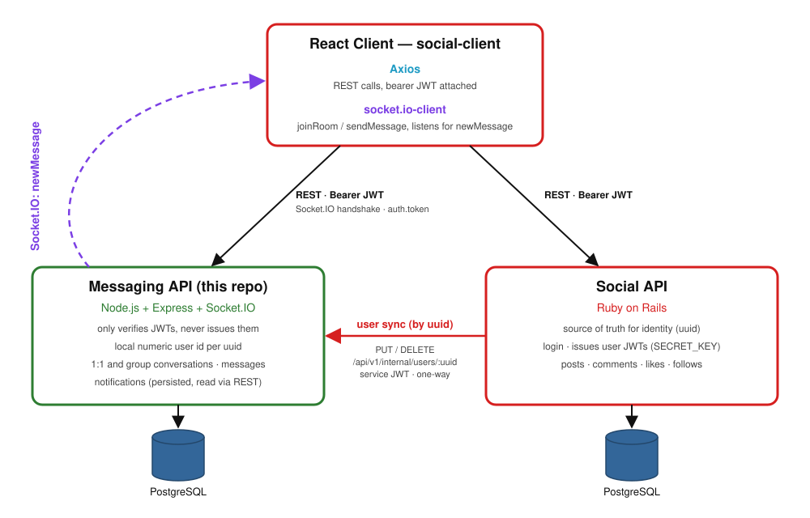
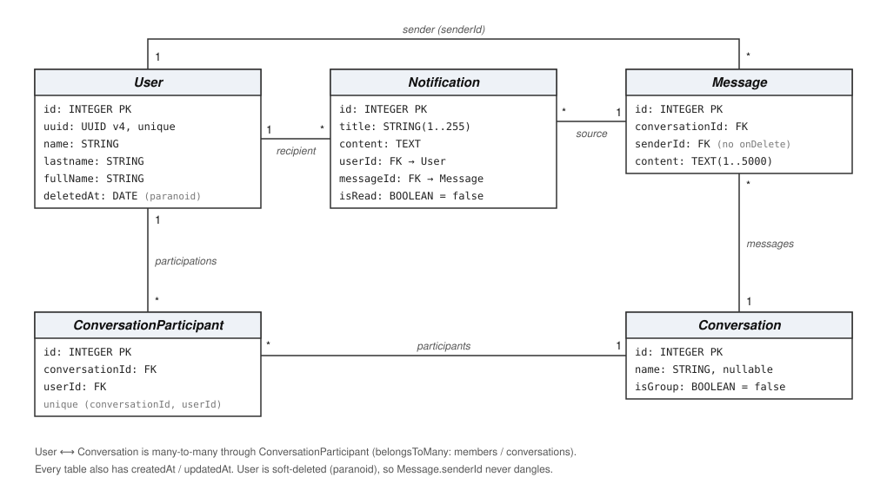

# Social Messaging API

## Table of Contents

- [Description](#description)
- [Features](#features)
- [System Architecture](#system-architecture)
- [Class Diagram](#class-diagram)
- [Technologies Used](#technologies-used)
- [Prerequisites](#prerequisites)
- [Installation](#installation)
- [Authentication](#authentication)
- [REST Endpoints](#rest-endpoints)
- [Real-Time Messaging (socket.io)](#real-time-messaging-socketio)
- [API Testing (Postman)](#api-testing-postman)
- [Development](#development)

## Description

The Social Messaging API is a Node.js service for real-time messaging over WebSockets (socket.io).
It handles 1:1 and group conversations, messages and notifications, and exposes a REST API to
query conversation history.

It's the "Messaging API" half of a two-service system: user identity, profiles and login live in
a separate **Social API** (Ruby on Rails). This service never issues tokens or stores passwords —
it only verifies JWTs, and keeps a minimal local copy of each user (`uuid`, `name`, `lastname`,
`fullName`) that the Social API keeps in sync.

## Features

- **Real-Time Messaging:** clients join a conversation's room and receive `newMessage` events as
  soon as anyone in it sends a message.
- **1:1 and Group Conversations:** conversations can have any number of participants, who can be
  added or removed later.
- **Notifications:** every message generates a persisted notification for each other participant,
  readable through the REST API.
- **JWT Verification:** every REST request and socket connection needs a JWT issued by the Social
  API.
- **Conversation History:** list your conversations and their messages through the REST API.

## System Architecture

How the client, this API and the Social API talk to each other:



Previous versions are kept as a record of how the design evolved:
[v1](doc/Social%20App-architecture.drawio.png) and
[v2](doc/Social%20App-architecture.drawio%20v2.png).

## Class Diagram

Models and their relationships (see `models/`):



The [original class diagram](doc/Social%20App-messaging-api.drawio.png) is kept for history.

## Technologies Used

- Node.js (>= 16.19.1; CI runs on Node 20)
- Express for the HTTP layer
- PostgreSQL, with `pg` / `pg-hstore` as drivers
- Sequelize as the ORM, `sequelize-cli` for migrations
- socket.io for real-time messaging
- jsonwebtoken to verify JWTs
- Jest, Supertest and socket.io-client for the test suite; ESLint for linting

## Prerequisites

- Node.js 16.19.1 or newer, and npm.
- A running PostgreSQL server, with a user allowed to create databases (or the databases below
  created by hand).
- The `SECRET_KEY` shared with the Social API, or any value of your choosing for local
  development (you'll sign your own test tokens with it, see [Authentication](#authentication)).

## Installation

1. **Clone the repository:**

   ```bash
   git clone git@github.com:brusatimatias/social-messaging-api.git
   cd social-messaging-api
   ```

2. **Install the dependencies:**

   ```bash
   npm install
   ```

3. **Configure environment variables:**

   Copy `.env.example` to `.env` and adjust it to match your PostgreSQL setup:

   ```bash
   cp .env.example .env
   ```

   ```env
   PORT=3001
   NODE_ENV=development
   POSTGRES_USER=yourusername
   POSTGRES_PASSWORD=yourpassword
   DB_HOST=localhost
   SECRET_KEY=yoursecretkey
   CORS_ORIGINS=http://localhost:8000
   ```

   - `SECRET_KEY` signs and verifies every JWT (user and service tokens alike). It must match the
     one the Social API uses.
   - `CORS_ORIGINS` is a comma-separated whitelist of client origins allowed to call the API
     (REST and the socket.io handshake both use it). Leave it empty to block every cross-origin
     caller — there's no `*` fallback.

4. **Create the database and run the migrations:**

   ```bash
   npx sequelize-cli db:create
   npx sequelize-cli db:migrate
   ```

   The database name depends on `NODE_ENV` (see `config/config.js`):
   `social-messaging-api-development`, `social-messaging-api-test` or
   `social-messaging-api-production`.

5. **Start the API:**

   ```bash
   npm start      # or `npm run dev` to restart on changes with nodemon
   ```

   The API listens on `http://localhost:3001` (or whatever `PORT` you set).

## Authentication

Every request under `/api/v1` and every socket connection needs a JWT signed (HS256) with
`SECRET_KEY`. There are two kinds of token, told apart by their payload:

| Caller | Payload | Can use |
| --- | --- | --- |
| End user (issued by the Social API at login) | `{ "uuid": "<user uuid>" }` | All of `/api/v1` except `/internal`, and sockets |
| Social API acting on its own behalf | `{ "service": "social-api" }` | Only `/api/v1/internal/*` |

A user token on an `/internal` route gets a `403`; a missing or invalid token gets a `401`.
User uuids must be valid UUID v4 values.

To generate tokens for local testing, use the same value as `SECRET_KEY` in your `.env`:

```bash
node -e "console.log(require('jsonwebtoken').sign({ uuid: '3f6c1e2a-8b4d-4c9e-9a7f-2d5e6b1c0a94' }, 'yoursecretkey'))"
node -e "console.log(require('jsonwebtoken').sign({ service: 'social-api' }, 'yoursecretkey'))"
```

The user must also exist locally. Create it through the internal sync endpoint
(`PUT /api/v1/internal/users/:uuid` with the service token) before using the user token.

## REST Endpoints

All routes live under `/api/v1` and need `Authorization: Bearer <jwt>`. Successful responses are
wrapped as `{ "data": ... }`, errors as `{ "error": { "message": "..." } }`. A malformed id or uuid
in the path or body returns `400`.

| Method | Path | Body | Success | Errors |
| --- | --- | --- | --- | --- |
| `GET` | `/users/:uuid` | — | `200` user (`id`, `uuid`, `name`, `lastname`, `fullName`) | `404` user |
| `GET` | `/conversations` | — | `200` conversations of the authenticated user | `404` user not synced |
| `POST` | `/conversations` | `{ isGroup?, name?, participantUuids }` | `201` conversation | `400` fewer than 2 uuids, `422` unknown uuid(s) |
| `GET` | `/conversations/:id` | — | `200` conversation | `404` conversation |
| `POST` | `/conversations/:id/participants` | `{ userUuid }` | `201` participant | `400` missing `userUuid`, `404` conversation/user, `409` already a participant |
| `DELETE` | `/conversations/:id/participants/:userUuid` | — | `204` | `404` user/participant |
| `GET` | `/conversations/:conversationId/messages` | — | `200` messages of the conversation | — |
| `POST` | `/conversations/:conversationId/messages` | `{ senderId, content }` | `201` message, also broadcast as `newMessage` | `400` missing field |
| `GET` | `/notifications` | — | `200` notifications of the authenticated user | `404` user not synced |
| `PUT` | `/internal/users/:uuid` | `{ name, lastname, fullName }` | `200` user (idempotent upsert) | `400` missing field, `403` user token |
| `DELETE` | `/internal/users/:uuid` | — | `204` (soft-delete) | `404` user, `403` user token |

`senderId` is the local numeric user id (`User.id`), not the uuid.

## Real-Time Messaging (socket.io)

Connect to the same host and port as the REST API, passing a **user** token in the handshake
(service tokens are rejected):

```js
import { io } from 'socket.io-client';

const socket = io('http://localhost:3001', { auth: { token: userToken } });

socket.emit('joinRoom', conversationId);
socket.on('newMessage', (message) => console.log(message));
socket.emit('sendMessage', { conversationId, senderId, content });
```

| Event | Direction | Payload | Behavior |
| --- | --- | --- | --- |
| `joinRoom` | client → server | `conversationId` | Joins the conversation's room. Ignored without error if the user isn't a participant. |
| `sendMessage` | client → server | `{ conversationId, senderId, content }` | Persists the message, creates a notification for every other participant and broadcasts `newMessage` to the room. |
| `newMessage` | server → client | the created message | Sent to everyone in the room, both for `sendMessage` and for `POST /conversations/:conversationId/messages`. |

Notifications aren't pushed over the socket; read them with `GET /api/v1/notifications`.

## API Testing (Postman)

A ready-to-import Postman collection covering every `/api/v1` endpoint lives at
[`doc/social-messaging-api.postman_collection.json`](doc/social-messaging-api.postman_collection.json).

**Import:** Postman → Import → select the file (or drag it in).

**Collection variables** (Collection → Variables tab):

| Variable | Default | Description |
| --- | --- | --- |
| `base_url` | `http://localhost:3001` | Matches the default `PORT` in `.env.example` — adjust if your `.env` uses a different one. |
| `userToken` | *(empty)* | User JWT, payload `{ uuid: '<user-uuid>' }` (see [Authentication](#authentication)). Used by every request except the `Internal` folder. |
| `serviceToken` | *(empty)* | Service JWT, payload `{ service: 'social-api' }`. Used only by the `Internal (Social API sync)` requests. |
| `userUuid` | `3f6c1e2a-8b4d-4c9e-9a7f-2d5e6b1c0a94` | Path param for user-scoped requests (`GET /users/:uuid`, internal sync). Must be a UUID v4. |
| `conversationId` | `1` | Path param for conversation/message requests. |

**Folders:**

- `Users` — `GET /api/v1/users/:uuid`
- `Conversations` — list/create conversations, add/remove participants
- `Messages` — list messages, send one via REST (fallback to the `sendMessage` socket event)
- `Notifications` — list notifications for the authenticated user
- `Internal (Social API sync)` — `PUT`/`DELETE /api/v1/internal/users/:uuid`, the endpoints the
  Social API calls on user create/update/delete (requires `serviceToken`, not `userToken`)

A typical first run: `PUT` a user (or two) through the internal folder, then create a
conversation with their uuids and send messages.

## Development

```bash
npm run lint                                  # ESLint
npm test                                      # full test suite
npx jest tests/routes/v1/messages.test.js     # a single file
```

The tests mock the Sequelize models and services, so they run without a live PostgreSQL
connection. CI (`.github/workflows/ci.yml`) runs `lint` and `test` as separate jobs on every push
and pull request.

If you're a developer interested in using our API or have any questions, please don't hesitate to get in touch:

- Email: [mformento8@gmail.com](mailto:mformento8@gmail.com)
